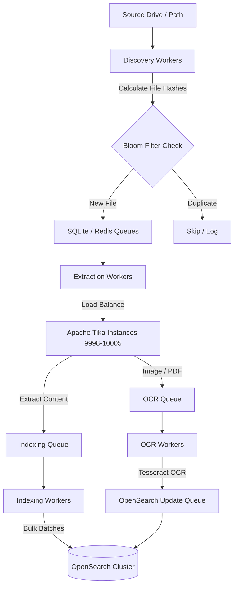

# RADAR: Enterprise Document Search System

RADAR is a production-grade, highly scalable, and concurrent document discovery, text extraction, indexing, and OCR pipeline. It is optimized to process millions of documents efficiently, extract textual content from over 1,000 formats, run optical character recognition (OCR) on image-heavy documents, apply NLP-based text correction, and index everything into OpenSearch for real-time search availability.

The system features a dual-queue architecture supporting both **Redis** (for distributed multi-node clusters) and **SQLite** (for zero-dependency standalone execution), with state preservation, checkpointing, and graceful pause/resume capabilities.

---

## 🏗️ Architecture Overview

RADAR processes files through a multi-stage concurrent pipeline managed by a **Master Orchestrator**. The orchestrator coordinates process-based workers that scale with available system cores.



### Pipeline Stages

1. **Discovery**: Scans the filesystem, calculates MurmurHash3 hashes, and uses a Bloom filter to skip already-indexed files. Valid files are queued.
2. **Extraction**: Spawns multiple workers to load-balance documents across Apache Tika instances. Files are divided into tracks by size (Fast, Standard, Heavy, Extreme) to prevent large files from blocking smaller ones.
3. **OCR (Background)**: Scans image-only or scanned PDFs using Tesseract OCR, processes images with OpenCV, and enriches indexed documents.
4. **NLP Correction**: OCR text is passed through a SpaCy corrector to repair spelling and OCR artifacts before final indexing.
5. **Indexing**: Batches documents and sends bulk index requests to OpenSearch.

---

## 🚀 Quick Start

### Prerequisites

1. **Python 3.10+**: Ensure Python is installed.
2. **Apache Tika**: Download `tika-server.jar` and place it in your Tika directory (e.g., `C:\Program Files\Tika\`).
3. **OpenSearch 2.x**: Running locally or on a remote cluster.
4. **Tesseract OCR**: Installed and added to the path or configured in `config/config.yaml`.
5. **Redis (Optional)**: Required if running in distributed queue mode.

### Installation

Clone the repository and install the production-grade dependencies:

```bash
git clone https://github.com/harshaaaaw/RADAR.git
cd RADAR
pip install -r requirements.txt
```

### Configuration

Copy and configure your main configuration file at `config/config.yaml`. It contains parameters to tune worker pools, Tika ports, OpenSearch cluster details, and OCR thresholds.

```yaml
# Example snippet
redis:
  url: 'redis://localhost:6379/0'
nlp:
  enabled: false # Memory optimization for extraction
extraction:
  total_workers: 100
  tika:
    instances: 8 # Ports 9998-10005
```

---

## ⚙️ Usage Guide

The system is managed using a production-ready CLI interface `src/main.py`.

### 1. Service Check
Verify that all dependent services (Tika, OpenSearch, Tesseract) are running and healthy:
```bash
python src/main.py check
```

### 2. Initialization
Prepare the directories, initialize the SQLite queue database, and validate configurations:
```bash
python src/main.py init
```

### 3. Start System
Start the pipeline. You can run the orchestrator in different modes:
* **Full**: Discovers and processes all files from scratch.
* **Resume**: Automatically detects the last checkpoint and resumes processing from the exact stopped position.
* **Incremental**: Scans for new files and indexes them.

```bash
python src/main.py start --mode resume
```

### 4. Monitor Status
Check the current progress, uptime, active queue sizes, and throughput rates:
```bash
python src/main.py status
```
For detailed statistics across all workers and error breakdowns, run:
```bash
python src/main.py stats
```

### 5. Stop System
Gracefully stop all running processes, serialize checkpoints, and save Bloom filters:
```bash
python src/main.py stop
```

### 6. Reset System
Clear all database queues, Bloom filters, and progress logs to start fresh:
```bash
python src/main.py reset
```

---

## 📊 Real-Time Dashboard

RADAR comes with a real-time monitoring dashboard built with Streamlit.

To launch the dashboard:
```bash
streamlit run src/ui/dashboard.py
```
Access the dashboard at `http://localhost:8501`. It provides visualization of:
* Active queue depths and stage distribution.
* Real-time extraction and indexing throughput.
* CPU and memory resource utilization.
* Average processing times and time-to-completion ETA.

---

## 📁 Directory Structure

```
RADAR/
├── bin/                 # Shell and batch scripts for service management
├── config/              # Configuration files (config.yaml, JVM options)
├── src/                 # Application source code
│   ├── api/             # FastAPI endpoint and server controls
│   ├── core/            # Queue managers (Redis & SQLite), configuration loaders
│   ├── discovery/       # Filesystem scanner and Bloom filter deduplication
│   ├── extraction/      # Tika client and size-based track partitioners
│   ├── indexing/        # Bulk indexing client for OpenSearch
│   ├── ocr/             # Image processing and Tesseract wrapper
│   ├── orchestrator/    # Master orchestrator process management
│   ├── tagging/         # Metadata manager and Excel taxonomy tags
│   ├── ui/              # Streamlit monitoring dashboard
│   └── utils/           # Helper scripts (hashing, loggers, resource monitors)
├── tests/               # Pytest test suites
└── requirements.txt     # Python package dependencies
```

---

## 🔧 Troubleshooting

* **Tika Not Responding**: Ensure Java 11+ is installed and check port conflicts on ports `9998-10005`.
* **Database Locked (SQLite)**: SQLite queue databases can get locked under high write volumes. If this occurs, switch configuration to Redis for production performance.
* **OpenSearch Connection Failures**: Check that port `9200` is open and verify cluster security configurations.
* **Worker Out of Memory**: If SpaCy models consume too much RAM, reduce the number of active OCR/Extraction workers in `config/config.yaml` or use a smaller language model.
