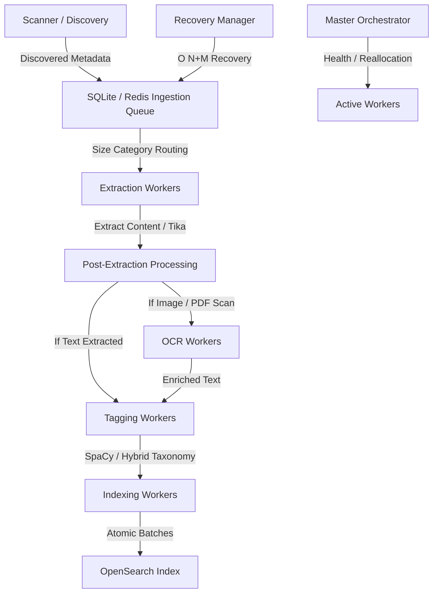

# CODEBASE EXPERT SYSTEM MANUAL: ENTERPRISE DOCUMENT INGESTION & SEARCH PIPELINE
**Authoritative Operational, Structural, and Algorithms Manual**

> [!IMPORTANT]
> This manual serves as the single source of truth for the Enterprise Document Search Ingestion and Tagging Pipeline. It provides complete line-referenced definitions of the system architecture, database schemas, NLP pipeline algorithms, statistical classification weights, and orchestrator recovery logic. Any agentic AI (such as Claude, Antigravity, or others) can immediately understand, maintain, debug, and expand this codebase by referencing this document.

---

## SECTION 1: SYSTEM ARCHITECTURAL OVERVIEW
The Document Search Ingestion Pipeline is an enterprise-grade, distributed, multi-worker system designed to ingest, extract, OCR, tag, index, and cache millions of documents from a file system to an OpenSearch cluster. 



### 1.1 Parallel Distributed Processing & Queue Layer Routing
Ingestion workloads are routed through a series of queues to decouple slow actions (e.g., Tika extraction, OCR, SpaCy tagging) from fast actions (e.g., directory discovery, OpenSearch indexing).
1. **Discovery Stage**: Scans folder structures on the source drive, calculates file metadata hashes, and adds files to `discovered_files`.
2. **Extraction Stage**: Routes files into size-specific processing queues (`tiny`, `small`, `medium`, `large`). Size-based worker allocation prevents head-of-line blocking (where massive PDFs stall small spreadsheets).
3. **OCR Enrichment Stage**: Scrapes image formats and unreadable scanned PDF pages using Apache Tesseract, feeding results back to text streams.
4. **Semantic Tagging Stage**: Applies rule-based matches and SpaCy NLP classification models to evaluate category, department, and purpose, generating confidence tags, metadata entity arrays, and dynamic keywords.
5. **OpenSearch Indexing Stage**: Batches indexed documents into atomic index commits.

### 1.2 Hardware & Worker Thread Profiles
The pipeline dynamically balances processing pipelines across CPU cores. Default worker levels are managed inside the configuration engine `src/core/config_manager.py`:
* **Discovery Workers**: Lightweight thread processes optimized for fast disk traversals.
* **Extraction Workers**: Distributed standard processes mapping Apache Tika server instances on specific ports.
* **OCR Workers**: Compute-heavy pools wrapping native OS Tesseract executions.
* **Tagging Workers**: RAM-heavy worker threads hosting local SpaCy language embeddings.
* **Indexing Workers**: Network-I/O bound threads handling bulk connections to OpenSearch.

---

## SECTION 2: DATABASES, SCHEMAS & QUEUE MANAGEMENT

The codebase supports dual backends: a single-node persistent fallback (SQLite) and a high-performance distributed backend (Redis). It implements a strict failover check to switch between SQLite and Redis dynamically if Redis connections become available.

### 2.1 SQLite Schema & Connection Architecture
*File Reference:* [`src/core/queue_manager.py`](file:///c:/Users/DELL/Downloads/DocumentSearch/DocumentSearch/src/core/queue_manager.py)

#### Connection Pragmas & WAL Mode
To enable concurrent multi-worker reads and writes without throwing `"database is locked"` exceptions, the SQLite thread-local connections are initiated with strict pragmatic adjustments:
* **Lines 136-150 (`_get_connection`)**:
  ```python
  self._local.connection = sqlite3.connect(
      self.db_path,
      isolation_level='DEFERRED',
      check_same_thread=False,
      timeout=60.0
  )
  self._local.connection.execute("PRAGMA journal_mode=WAL")
  self._local.connection.execute("PRAGMA synchronous=NORMAL")
  self._local.connection.execute("PRAGMA cache_size=-64000")  # 64MB cache
  self._local.connection.execute("PRAGMA temp_store=MEMORY")
  self._local.connection.execute("PRAGMA busy_timeout=60000")  # 60s timeout
  ```

#### Exact Table DDLs
The following SQLite tables form the atomic basis of the ingestion state-machine (initialized in `_initialize_database` at **lines 174-410**):

##### 1. `system_flags`
Tracks environment variables and global flags dynamically.
```sql
CREATE TABLE IF NOT EXISTS system_flags (
    key TEXT PRIMARY KEY,
    value TEXT,
    updated_at REAL
);
```

##### 2. `discovered_files`
The master ledger tracking every discovered file on disk.
```sql
CREATE TABLE IF NOT EXISTS discovered_files (
    id INTEGER PRIMARY KEY AUTOINCREMENT,
    file_path TEXT NOT NULL UNIQUE,
    file_name TEXT NOT NULL,
    file_size INTEGER NOT NULL,
    file_extension TEXT,
    file_hash TEXT NOT NULL,
    last_modified REAL NOT NULL,
    created REAL NOT NULL,
    size_category TEXT NOT NULL,
    priority INTEGER NOT NULL DEFAULT 5,
    status TEXT NOT NULL DEFAULT 'pending',
    discovered_at REAL NOT NULL,
    worker_id TEXT,
    processing_started_at REAL,
    processing_completed_at REAL,
    error_type TEXT,
    error_message TEXT,
    retry_count INTEGER DEFAULT 0
);
CREATE INDEX IF NOT EXISTS idx_discovered_status ON discovered_files (status);
CREATE INDEX IF NOT EXISTS idx_discovered_file_hash ON discovered_files (file_hash);
CREATE INDEX IF NOT EXISTS idx_discovered_priority_status ON discovered_files (priority, status);
CREATE INDEX IF NOT EXISTS idx_discovered_size_category ON discovered_files (size_category, status);
```

##### 3. `extraction_queue`
Routes content extraction requests split by worker size categories.
```sql
CREATE TABLE IF NOT EXISTS extraction_queue (
    id INTEGER PRIMARY KEY AUTOINCREMENT,
    file_id INTEGER NOT NULL,
    file_path TEXT NOT NULL,
    file_size INTEGER NOT NULL,
    size_category TEXT NOT NULL,
    priority INTEGER NOT NULL,
    status TEXT NOT NULL DEFAULT 'pending',
    worker_id TEXT,
    claimed_at REAL,
    completed_at REAL,
    processing_time_ms INTEGER,
    FOREIGN KEY (file_id) REFERENCES discovered_files(id)
);
CREATE INDEX IF NOT EXISTS idx_extraction_size_status ON extraction_queue (size_category, status, priority);
CREATE INDEX IF NOT EXISTS idx_extraction_worker ON extraction_queue (worker_id);
CREATE INDEX IF NOT EXISTS idx_extraction_claimed_timeout ON extraction_queue (status, claimed_at);
```

##### 4. `ocr_queue`
Defines isolated processing queues for optical character recognition.
```sql
CREATE TABLE IF NOT EXISTS ocr_queue (
    id INTEGER PRIMARY KEY AUTOINCREMENT,
    file_id INTEGER NOT NULL,
    file_path TEXT NOT NULL,
    page_number INTEGER DEFAULT NULL,
    priority INTEGER NOT NULL,
    status TEXT NOT NULL DEFAULT 'pending',
    worker_id TEXT,
    claimed_at REAL,
    completed_at REAL,
    ocr_confidence REAL,
    processing_time_ms INTEGER,
    document_id TEXT,
    FOREIGN KEY (file_id) REFERENCES discovered_files(id)
);
CREATE INDEX IF NOT EXISTS idx_ocr_priority_status ON ocr_queue (priority, status);
CREATE INDEX IF NOT EXISTS idx_ocr_worker ON ocr_queue (worker_id);
CREATE INDEX IF NOT EXISTS idx_ocr_claimed_timeout ON ocr_queue (status, claimed_at);
```

##### 5. `tagging_queue`
Manages async workloads destined for tagging engines.
```sql
CREATE TABLE IF NOT EXISTS tagging_queue (
    id INTEGER PRIMARY KEY AUTOINCREMENT,
    file_id INTEGER NOT NULL,
    file_path TEXT,
    file_hash TEXT,
    doc_id TEXT,
    priority INTEGER NOT NULL DEFAULT 5,
    status TEXT NOT NULL DEFAULT 'pending',
    worker_id TEXT,
    claimed_at REAL,
    completed_at REAL,
    processing_time_ms INTEGER,
    retry_count INTEGER DEFAULT 0,
    error_message TEXT,
    FOREIGN KEY (file_id) REFERENCES discovered_files(id)
);
CREATE INDEX IF NOT EXISTS idx_tagging_status ON tagging_queue (status);
CREATE INDEX IF NOT EXISTS idx_tagging_claimed_timeout ON tagging_queue (status, claimed_at);
CREATE INDEX IF NOT EXISTS idx_tagging_file_id ON tagging_queue (file_id);
```

##### 6. `indexing_queue`
Accumulates extracted and tagged JSON documents ready for bulk ingestion.
```sql
CREATE TABLE IF NOT EXISTS indexing_queue (
    id INTEGER PRIMARY KEY AUTOINCREMENT,
    file_id INTEGER NOT NULL,
    document_json TEXT NOT NULL,
    status TEXT NOT NULL DEFAULT 'pending',
    worker_id TEXT,
    claimed_at REAL,
    indexed_at REAL,
    batch_id TEXT,
    retry_count INTEGER DEFAULT 0,
    FOREIGN KEY (file_id) REFERENCES discovered_files(id)
);
CREATE INDEX IF NOT EXISTS idx_indexing_status ON indexing_queue (status);
CREATE INDEX IF NOT EXISTS idx_indexing_batch ON indexing_queue (batch_id);
CREATE INDEX IF NOT EXISTS idx_indexing_claimed_timeout ON indexing_queue (status, claimed_at);
```

##### 7. `completed_files` & `failed_files`
The final state targets for processed files.
```sql
CREATE TABLE IF NOT EXISTS completed_files (
    id INTEGER PRIMARY KEY AUTOINCREMENT,
    file_id INTEGER NOT NULL,
    file_path TEXT NOT NULL,
    file_hash TEXT NOT NULL,
    content_hash TEXT,
    document_id TEXT,
    is_duplicate BOOLEAN DEFAULT 0,
    duplicate_of TEXT,
    indexed_at REAL NOT NULL,
    extraction_time_ms INTEGER,
    indexing_time_ms INTEGER,
    ocr_completed BOOLEAN DEFAULT 0,
    ocr_confidence REAL,
    FOREIGN KEY (file_id) REFERENCES discovered_files(id)
);
CREATE INDEX IF NOT EXISTS idx_completed_file_hash ON completed_files (file_hash);
CREATE INDEX IF NOT EXISTS idx_completed_content_hash ON completed_files (content_hash);
CREATE INDEX IF NOT EXISTS idx_completed_document_id ON completed_files (document_id);

CREATE TABLE IF NOT EXISTS failed_files (
    id INTEGER PRIMARY KEY AUTOINCREMENT,
    file_id INTEGER NOT NULL,
    file_path TEXT NOT NULL,
    stage TEXT NOT NULL,
    error_type TEXT NOT NULL,
    error_message TEXT,
    failed_at REAL NOT NULL,
    retry_count INTEGER,
    stack_trace TEXT,
    FOREIGN KEY (file_id) REFERENCES discovered_files(id)
);
CREATE INDEX IF NOT EXISTS idx_failed_stage_error ON failed_files (stage, error_type);
```

##### 8. `file_hashes` & `content_hashes`
Deduplication key maps.
```sql
CREATE TABLE IF NOT EXISTS file_hashes (
    file_hash TEXT PRIMARY KEY,
    first_file_path TEXT NOT NULL,
    first_seen_at REAL NOT NULL,
    duplicate_count INTEGER DEFAULT 0,
    duplicate_paths TEXT
);

CREATE TABLE IF NOT EXISTS content_hashes (
    content_hash TEXT PRIMARY KEY,
    first_file_path TEXT NOT NULL,
    first_document_id TEXT NOT NULL,
    first_seen_at REAL NOT NULL,
    duplicate_count INTEGER DEFAULT 0
);
```

---

### 2.2 Redis Keyspace Schema Design
*File Reference:* [`src/core/redis_queue_manager.py`](file:///c:/Users/DELL/Downloads/DocumentSearch/DocumentSearch/src/core/redis_queue_manager.py)

To facilitate massive parallel workloads across dynamic workers, Redis utilizes native structures (Sorted Sets, Lists, Hashes, and Sets).

#### Keyspace Layout (Namespaces)
All keys share the prefix `docsearch:` (**lines 38-89**):

| Redis Key / Key Pattern | Data Structure | Purpose |
| :--- | :--- | :--- |
| `docsearch:queue:discovery` | ZSET | Discovered file IDs scored by `priority`. |
| `docsearch:queue:extraction:<size>` | ZSET | Pending extraction queue scored by `priority`. |
| `docsearch:queue:indexing` | LIST | FIFO queue of serialized documents ready for OpenSearch. |
| `docsearch:queue:ocr` | ZSET | Pending OCR tasks scored by `priority`. |
| `docsearch:queue:tagging` | ZSET | Pending tagging requests scored by `priority`. |
| `docsearch:queue:folders` | LIST | Traversal queues for directory structures. |
| `docsearch:files:<file_id>` | HASH | Individual metadata dictionary for file entry. |
| `docsearch:file_paths` | HASH | Index map translating `file_path` string $\rightarrow$ `file_id`. |
| `docsearch:completed` | HASH | Registry of completed files indexed by `file_hash`. |
| `docsearch:failed` | HASH | Failure records keyed by `file_id`. |
| `docsearch:processing:extraction:<worker>` | HASH | Atomic record of files currently claimed by an extraction worker. |
| `docsearch:processing:indexing:<worker>` | HASH | Atomic record of files currently claimed by an indexing worker. |
| `docsearch:processing:ocr:<worker>` | HASH | Atomic record of files currently claimed by an OCR worker. |
| `docsearch:processing:tagging:<worker>` | HASH | Atomic record of files currently claimed by a tagging worker. |
| `docsearch:file_hashes` | SET | SADD-guarded unique file hashes. |
| `docsearch:content_hashes` | SET | SADD-guarded unique content hashes. |
| `docsearch:completed_file_ids` | SET | Set tracking completed files (by ID) to avoid double-counting. |
| `docsearch:counter:discovered` | STRING | Global counter tracking total discovered files. |
| `docsearch:counter:completed` | STRING | Global counter tracking total indexed files. |

---

### 2.3 Redis Lua Scripts & Transaction Loops

#### 1. Native ZPOPMIN Compatibility Loop
Older Redis installations (3.x) do not natively support the `ZPOPMIN` command. To prevent crashes, `RedisQueueManager` implements an atomic fallback loop using `WATCH`, `ZRANGE`, and `ZREM` within a retry transaction block (**lines 255-329**):

```python
# Fast path (Redis >= 5.0)
try:
    raw = self.client.execute_command("ZPOPMIN", key, count)
    # Parse results...
    return items
except redis.ResponseError as e:
    if "unknown command" not in str(e).lower():
        raise

# Fallback path (Redis < 5.0) using pessimistic WATCH transaction
max_attempts = 3
for _ in range(max_attempts):
    pipe = self.client.pipeline(True)
    try:
        pipe.watch(key)
        items = pipe.zrange(key, 0, count - 1, withscores=True)
        if not items:
            pipe.unwatch()
            return []
        pipe.multi()
        for item, _score in items:
            pipe.zrem(key, item)
        pipe.execute()
        return items
    except redis.WatchError:
        time.sleep(random.uniform(0.01, 0.05))
        continue
```

#### 2. Atomic Multi-Counter Increments
To prevent out-of-sync dashboard metrics, an atomic Lua script is registered on initialization to write completion records and safely increment total searchable counters in a single step (**lines 149-165**):

```lua
local set_key = KEYS[1]
local count_key = KEYS[2]
local size_key = KEYS[3]
local file_id = ARGV[1]
local file_size = tonumber(ARGV[2])

if redis.call('SADD', set_key, file_id) == 1 then
    redis.call('INCR', count_key)
    if file_size > 0 then
        redis.call('INCRBY', size_key, file_size)
    end
    return 1 -- New root file
else
    return 0 -- Already counted
end
```

---

## SECTION 3: PRODUCTION-GRADE NLP & TEXT CORRECTING

*File Reference:* [`src/nlp/text_corrector.py`](file:///c:/Users/DELL/Downloads/DocumentSearch/DocumentSearch/src/nlp/text_corrector.py)

Extraction and OCR processes often introduce common character confusions (e.g., misreading letters as numbers or punctuation). The `TextCorrector` applies a rule-based NLP pipeline to correct spelling mistakes, date errors, and amount formatting before documents are indexed in OpenSearch.

### 3.1 Multi-Stage Correction Pipeline
The text correction process runs across 6 sequential stages in the `correct()` function (**lines 206-255**):

```
[Raw Content]
     │
     ▼
[Stage 1: Dates & Years]  ──► Fixes invalid days and OCR year confusions
     │
     ▼
[Stage 2: Amounts & Currency] ──► Fixes spacing, commas, and currency symbols
     │
     ▼
[Stage 3: Character OCR Fixes] ──► Resolves ligatures and smart quote/dash encodings
     │
     ▼
[Stage 4: Dictionary Mapping] ──► Replaces common misspelled financial terms
     │
     ▼
[Stage 5: Common Word Patterns] ──► Fixes broken word suffixes and state abbreviations
     │
     ▼
[Stage 6: SpaCy NER Validation] ──► Restricts updates to validated MONEY/DATE entities
     │
     ▼
[Sanitized Content]
```

---

### 3.2 Exact Stage Algorithms & Regular Expressions

#### Stage 1: Critical Dates & Years
* **Lines 257-303 (`_fix_dates_years`)**: Corrects OCR year confusions (e.g., changing invalid characters like `l` or `I` back to `1`) and caps calendar days to their real monthly limits.
  
  ##### Year Substitutions (Regex boundaries)
  * `\b2041\b` $\rightarrow$ `2011` *(Note: OCR frequently misidentifies 2011 as 2041)*
  * `\b20ll\b` $\rightarrow$ `2011`
  * `\b20I1\b` $\rightarrow$ `2011`
  * `\b20l1\b` $\rightarrow$ `2011`
  * `\b201l\b` $\rightarrow$ `2011`
  * `\b2O11\b` $\rightarrow$ `2011`
  * `\b20\|1\b` $\rightarrow$ `2011`

  ##### Monthly Day Caps
  Matches dates formatted as `<Month> <Day>` where the day is larger than the monthly limit (usually caused by OCR misreading subsequent page layout characters) and caps them.
  * **31-Day Months** (`January`, `March`, `May`, `July`, `August`, `October`, `December`):
    Matches `(Month)\s+([4-9]\d+)` and caps the value at `31` (e.g., `January 45` becomes `January 31`).
  * **30-Day Months** (`April`, `June`, `September`, `November`):
    Matches `(Month)\s+([4-9]\d+)` and caps the value at `30`.
  * **February**:
    Matches `(February)\s+([3-9]\d+)` and caps the value at `28`.

---

#### Stage 2: Financial Amounts & Currencies
* **Lines 305-331 (`_fix_amounts`)**: Formats numbers and fixes currency issues.

  ##### Space-separated Thousands
  Locates currency values separated by spaces rather than commas (e.g., `$97 621` becomes `$97,621`).
  * **Regex**: `r'\$\s*(\d+)\s+(\d{3})\b'`
  * **Replacement**: `r'$\1,\2'`

  ##### Parenthesized Financial Amounts
  Corrects spacing within parenthesized accounting values (e.g., `( $97 621 )` becomes `($97,621)`).
  * **Regex**: `r'\(\s*\$?\s*(\d+)\s+(\d{3})\s*\)'`
  * **Replacement**: `r'($\1,\2)'`

  ##### Extra Spaces After Currency Symbols
  Removes spacing between currency symbols and values (e.g., `$ 15,000` becomes `$15,000`).
  * **Regex**: `r'\$\s+'`
  * **Replacement**: `r'$'`

---

#### Stage 3: Character-level OCR & Standalone Pipes
* **Lines 333-357 (`_fix_character_errors`)**: Corrects character-level misreads.
  
  > [!WARNING]
  > Character translations like replacing '0' with 'O' or '1' with 'I' are blocked at this stage. Running global character swaps across financial documents corrupts numeric data (e.g., rendering `$10,000` as `$IO,OOO`).

  ##### Standard Ligatures
  Swaps complex typographical ligatures back to individual character sets:
  * `fi` $\rightarrow$ `fi`
  * `fl` $\rightarrow$ `fl`
  * `ff` $\rightarrow$ `ff`
  * `ffi` $\rightarrow$ `ffi`
  * `ffl` $\rightarrow$ `ffl`

  ##### Smart Quotes & Dashes
  Converts stylized symbols back to standard ASCII characters:
  * `\u2018` (Smart single open quote) $\rightarrow$ `'`
  * `\u2019` (Smart single close quote) $\rightarrow$ `'`
  * `\u201c` (Smart double open quote) $\rightarrow$ `"`
  * `\u201d` (Smart double close quote) $\rightarrow$ `"`
  * `\u2013` (En-dash) $\rightarrow$ `-`
  * `\u2014` (Em-dash) $\rightarrow$ `-`

  ##### Standalone Pipe Processing
  * Translates pipe characters surrounded by characters back to letters (likely a misread uppercase `I` or lowercase `l`):
    * **Regex**: `r'(\w)\|(\w)'`
    * **Replacement**: `r'\1I\2'`
  * Translates standalone pipes with padding spaces: ` | ` $\rightarrow$ ` I `.

---

#### Stage 4 & 5: Suffix & Spelling Dictionary Mapping
* **Lines 359-442 (`_apply_dictionary` and `_fix_common_patterns`)**: Normalizes misspelled words and US state postal abbreviations.

  ##### Word Correction Dictionary
  Contains a lookup table of commonly misspelled financial and real estate terms:
  * `baiance sheet` $\rightarrow$ `balance sheet`
  * `income statment` $\rightarrow$ `income statement`
  * `cash fiow statement` $\rightarrow$ `cash flow statement`
  * `accounts receivabie` $\rightarrow$ `accounts receivable`
  * `accounts payabie` $\rightarrow$ `accounts payable`
  * `attorney fess` $\rightarrow$ `attorney fees`
  * `real esate` $\rightarrow$ `real estate`
  * `finaIIy` $\rightarrow$ `finally`
  * `staternent` $\rightarrow$ `statement`
  * `lnvestment` $\rightarrow$ `investment`

  ##### US State Abbreviation Normalization
  Fixes common character confusions in US state postal codes (e.g., using `l` or `1` instead of `I`):
  * ` lX ` or ` 1X ` $\rightarrow$ ` TX `
  * `|TX` $\rightarrow$ ` TX`
  * ` lA ` or ` 1A ` $\rightarrow$ ` LA `
  * ` M0 ` $\rightarrow$ ` MO `

---

#### Stage 6: SpaCy Named Entity Context Verification
* **Lines 444-500 (`_apply_spacy_corrections`)**: When a SpaCy model is loaded, the corrector runs a final contextual check using Named Entity Recognition (NER). It evaluates identified `MONEY` and `DATE` entity ranges and applies regex corrections only within those specific bounds. This prevents rules from altering alphanumeric codes or strings outside currency and date contexts.

---

## SECTION 4: SEMANTIC TAGGING & CLASSIFICATION ENGINE

*File Reference:* [`src/tagging/tagging_engine.py`](file:///c:/Users/DELL/Downloads/DocumentSearch/DocumentSearch/src/tagging/tagging_engine.py)

The `TaggingEngine` evaluates documents and matches them against taxonomies using a hybrid approach (regex rules, dictionary alias maps, and vector embeddings).

### 4.1 Hybrid Scoring Formula & Signal Weights
The overall confidence score for each field (`category`, `department`, and `purpose`) is calculated as a sum of 7 individual signal weights. The final score is normalized against a maximum theoretical score of `_MAX_RAW_SCORE = 2.0` (**line 41**).

$$\text{Confidence Score} = \min\left(1.0, \frac{\sum_{i=1}^{7} W_i \cdot S_i}{\text{\_MAX\_RAW\_SCORE}}\right)$$

The individual signals and their weights are defined as follows:

| Signal ($i$) | Weight ($W_i$) | Code Reference | Description & Mathematical Formula |
| :--- | :---: | :--- | :--- |
| **Semantic Similarity** | $0.30$ | Lines 185-198 | Local cosine similarity score calculated between SpaCy document embeddings and a rich taxonomy label description:<br>$$\text{semantic\_text} = \text{"\{label\}. Related terms: \{aliases\}. Keywords: \{keywords\}."}$$ |
| **Noun-Chunk Similarity** | $0.25$ | Lines 200-227 | Extracts noun chunks from the document and calculates similarity against the taxonomy label. If chunk similarity $> 0.70$, adds $0.08$ per hit (capped at $0.25$ max). |
| **Entity-Category Alignment** | $0.20$ | Lines 229-251 | Checks for specific entity sets based on the category. Generic entities (such as `ORG`, `PERSON`, or `DATE`) are ignored. Overlapping entities add $0.10$ per hit (capped at $0.20$ max):<br>• `Finance`: Requires `MONEY` or `PERCENT` entities.<br>• `Legal`/`Compliance`: Requires `LAW` entities. |
| **Alias Phrase Match (Body)** | $0.30$ | Lines 253-268 | Evaluates taxonomy aliases against the document body using word boundaries. Add $0.30$ if a match is found. |
| **Alias Phrase Match (Path)** | $0.20$ | Lines 253-268 | Evaluates taxonomy aliases against the file path using word boundaries. Add $0.20$ if a match is found. |
| **Keyword Token Coverage** | $0.35$ | Lines 270-286 | Calculates keyword hit coverage ratio (capped at $0.35$ max):<br>$$S_{\text{keyword}} = \frac{\text{unique keywords matched}}{\max(1, \text{total keywords in taxonomy row})}$$ |
| **Label Token Overlap** | $0.15$ | Lines 288-297 | Calculates token overlap ratio between label terms and document text:<br>$$S_{\text{overlap}} = \frac{|\text{Label Tokens} \cap \text{Document Tokens}|}{|\text{Label Tokens}|}$$ |
| **Feedback Boost** | $0.20$ | Lines 299-305 | Applies a custom operator correction weight boost, loaded dynamically via `taxonomy.get_feedback_boost` (capped at $0.20$ max). |

---

### 4.2 Anti-Hallucination Guard Rails & Degraded Fallbacks
The system implements several safety guards to prevent tagging errors when processing short, corrupted, or ambiguous files.

#### 1. Content Volume Guard
* **Lines 595-626 (`tag`)**: If the total length of the document text (including extraction, OCR, and embedded contents) is less than **50 characters**, the classification process stops immediately. The file is assigned a default status of `"Unclassified"`, its status is set to `insufficient_content`, and it is flagged for manual review (`review_required=True`).

#### 2. Ambiguous Classification Tie-Breaker
* **Lines 317-325 (`_score_field`)**: If the gap between the top candidate and the runner-up is too narrow (e.g., less than $0.05$) and the raw score is low (e.g., less than $0.30$), the classification is considered ambiguous. The raw score is capped at a maximum of $0.15$ to trigger downstream fallbacks and flag the file for manual review.
  
  ```python
  if len(ranked) > 1:
      runner_up_score = ranked[1][1]["score"]
      gap = raw - runner_up_score
      if gap < 0.05 and raw < 0.30:
          best_meta["reasons"].append("ambiguous_tie")
          raw = min(raw, 0.15)  # Force fallback
  ```

#### 3. Degraded Mode Cap
* **Lines 326-330 (`_score_field`)**: If the SpaCy model is missing or fails to load, the engine falls back to a rule-based matching mode. To prevent inflated confidence scores in rule-based mode, raw scores are capped at a maximum of `1.20` (equivalent to a maximum confidence score of `60%`), and the document is flagged for review (`review_required=True`).

#### 4. Cross-Field Consistency Checks
* **Lines 840-852 (`_check_cross_field_consistency`)**: Evaluates the classification results for logical conflicts. If all three core fields (`category`, `department`, and `purpose`) fail validation and fall back to their defaults, the system flags a `consistency:all_fields_fallback` issue and sends the document for manual review.

---

### 4.3 Garbage Entity Filters
* **Lines 335-397 (`_is_garbage_entity`)**:
  Before named entities are written to index records, they are evaluated against a garbage filter to remove noise from spreadsheet structures, layout files, and system tables. An entity is discarded if it matches any of the following patterns:
  1. **Alpha Ratio Filter**: The string must contain at least 2 alphabetic characters. Additionally, for strings longer than 4 characters, at least 40% of the characters must be alphabetic. This filters out hexadecimal IDs, numbers, and system codes.
  2. **Short Uppercase Codes**: Strings under 4 characters that are fully capitalized (e.g., `DFL`, `MLP`, `GL`, `COA`) are discarded as internal codes rather than actual entities.
  3. **Excel Cell References**: Discards cell indices (e.g., `A1:D10` or `$B$24:$B$24`) and coordinate strings.
  4. **Table Header Pattern**: Matches common tabular headers (e.g., `Debit`, `Credit`, `Ledger`, `Variance`, `Colomn`, `Row`) using case-insensitive regular expressions to avoid extracting column names as entities.
  5. **URL & File Path Fragments**: Filters out URL segments, domain fragments (e.g., `www.`, `.com`), and file paths (e.g., `C:\Windows` or `/etc/`).

---

### 4.4 Dynamic Subtag Derivation (Concept-Distance Clustering)
* **Lines 767-804 (`tag`)**:
  Instead of using a static, hardcoded list, the system dynamically discovers up to 15 relevant subtags per document using a clustering algorithm:
  1. **Direct Matches**: Extracts validated taxonomy keywords and aliases that triggered positive matches during the scoring phase.
  2. **Taxonomy Scan**: Performs a direct keyword scan of the active document text to find other related taxonomy terms.
  3. **Embedding Vector Similarity**: Extracts noun chunks from the document and calculates their semantic similarity against the taxonomy labels. If the vector similarity score is greater than `0.50`, the chunk is added as a dynamic subtag.

---

## SECTION 5: ORCHESTRATION & RESILIENCE RESCUER

The `MasterOrchestrator` manages worker processes, balances processing loads, and handles error recovery.

### 5.1 Dynamic Worker Reallocation
*File Reference:* [`src/orchestrator/master_orchestrator.py`](file:///c:/Users/DELL/Downloads/DocumentSearch/DocumentSearch/src/orchestrator/master_orchestrator.py) (**lines 685-802**)

The orchestrator runs a reallocation check every 60 seconds to identify processing bottlenecks and move idle workers to busy stages:
1. **Memory Ceiling Guard**: The orchestrator checks the system's memory usage before reallocating workers. If the host memory usage is higher than **85%**, reallocation is skipped to prevent out-of-memory crashes.
2. **Discovery Recovery**: If new directories are pending scan (`discovery_pending > 0`) but no discovery workers are active, the orchestrator immediately spawns new discovery workers.
3. **Ingestion Bottleneck Rebalancing**: If the tagging queue has a backlog (`tagging_pending > 100`) and the active tagging worker count is low, the orchestrator identifies idle workers in other stages (e.g., extraction, indexing, or OCR queues that are empty).
4. **Worker Redistribution**: The orchestrator terminates idle workers in other stages and spawns new tagging workers (up to a maximum of 8) to help resolve the bottleneck.

---

### 5.2 Crash Backoff Shield
*File Reference:* [`src/orchestrator/master_orchestrator.py`](file:///c:/Users/DELL/Downloads/DocumentSearch/DocumentSearch/src/orchestrator/master_orchestrator.py) (**lines 494-530**)

To prevent system lockups from recursive crash loops (such as a worker repeatedly crashing on a corrupted file), the orchestrator tracks process crashes using a sliding time window:
* **Crash Threshold**: A worker process is blocked from restarting if it crashes **5 times** or more within a **300-second (5 minute)** window.
* **Crash History Tracking**:
  ```python
  now = time.time()
  if worker_id not in self._crash_history:
      self._crash_history[worker_id] = []
  
  # Purge crashes outside the active window
  self._crash_history[worker_id] = [
      t for t in self._crash_history[worker_id]
      if (now - t) < self._crash_window
  ]
  self._crash_history[worker_id].append(now)
  
  if len(self._crash_history[worker_id]) >= self._max_crashes:
      logger.error(f"Worker {worker_id} crashed {len(self._crash_history[worker_id])} times. Blocked from respawning.")
      continue
  ```

---

### 5.3 O(N+M) Resilience Rescuer Algorithm
*File Reference:* [`src/orchestrator/recovery_manager.py`](file:///c:/Users/DELL/Downloads/DocumentSearch/DocumentSearch/src/orchestrator/recovery_manager.py) (**lines 30-218**)

When processes crash or connection timeouts occur, tasks can get stuck in a `"pending"` or `"processing"` state without being assigned to an active queue. The `RecoveryManager` identifies and rescues these "zombie" tasks.

Traditional recovery systems run nested loops that compare active tasks against queue items, which results in a slow time complexity of $O(N \cdot M)$. The `RecoveryManager` optimizes this process to a fast linear time complexity of $O(N + M)$ by using set lookups.

```
                  [Start Recovery Scan]
                           │
                           ▼
          ┌──────────────────────────────────┐
          │ Phase 1: Collect Queued IDs (O)  │
          │ • Discovery, Extraction Zsets    │
          │ • OCR, Tagging Zsets             │
          │ • Indexing List                  │
          └──────────────────────────────────┘
                           │
                           ▼
          ┌──────────────────────────────────┐
          │ Phase 2: Collect Active IDs (P)  │
          │ • Read hkeys from processing keys│
          └──────────────────────────────────┘
                           │
                           ▼
          ┌──────────────────────────────────┐
          │ Phase 3: Combine Set             │
          │ • all_active_ids = O ∪ P         │
          └──────────────────────────────────┘
                           │
                           ▼
              ┌──────────────────────────┐
              │ Phase 4: SCAN files (N)  │◄──────────┐
              └──────────────────────────┘           │
                           │                         │
                           ▼                         │
               Does file_id exist in                 │
                 all_active_ids?                     │
               (O(1) Hash Set check)                 │
                     /       \                       │
                   Yes        No                     │
                   /            \                    │
         [Keep File State]   [Zombie Detected]       │
                                  │                  │
                                  ▼                  │
                         [Reset status to pending    │
                          and requeue to extraction] │
                                  │                  │
                                  └──────────────────┘
```

#### Step 1: Pre-collect Queued IDs (O(M))
The system scans all pending queues using `ZSCAN` and `LRANGE` commands, adding all active file IDs to a set named `active_file_ids`. This includes items from the discovery, extraction, OCR, tagging, and indexing queues (**lines 94-175**).

#### Step 2: Pre-collect Processing IDs (O(P))
The system queries all active worker keys using the `HKEYS` command and adds the running file IDs to another set named `processing_file_ids` (**lines 177-218**).

#### Step 3: Combined Active Lookup (O(1))
The two sets are combined into a master set of all active files:

$$\text{all\_active\_ids} = \text{active\_file\_ids} \cup \text{processing\_file\_ids}$$

#### Step 4: Iterative Scan (O(N))
The system runs a `SCAN` loop over all file metadata hashes stored in `docsearch:files:*`. It parses the `file_id` from each key and checks its status.
If a file's status is set to `PENDING` or `PROCESSING` but its `file_id` is missing from `all_active_ids` (an $O(1)$ set lookup check), the file is identified as a zombie task. The orchestrator resets the file's status and adds it back to the extraction queue.

---

## SECTION 6: OPERATORS' PLAYBOOK

This section provides operational commands and troubleshooting steps for system operators.

### 6.1 Operational Scripts & CLI Commands

#### 1. Full Ingestion Inception
Runs a complete system reset and restarts the ingestion process:
* **Windows (PowerShell)**:
  ```powershell
  .\full_reset.ps1
  .\start-system.ps1 -Mode full
  ```
* **Linux/macOS**:
  ```bash
  ./start_everything.sh --mode full
  ```

#### 2. Graceful Shutdown
Triggers the graceful shutdown sequence:
* **Signal**: Send a `SIGINT` (Ctrl+C) or `SIGTERM` signal to the parent Master Orchestrator process. The orchestrator will save a final state checkpoint, stop all workers, and terminate active threads.

---

### 6.2 Streamlit Dashboard & Metrics Caching
*File Reference:* [`src/ui/dashboard.py`](file:///c:/Users/DELL/Downloads/DocumentSearch/DocumentSearch/src/ui/dashboard.py)

The frontend monitoring dashboard is built with Streamlit and uses caching to prevent slow database queries during page updates.

#### 1. Page Refresh Control
The dashboard uses the `streamlit_autorefresh` component (**lines 27-32**) to update page contents at a regular interval without full browser refreshes.

#### 2. Multi-tier Caching Layer
* **Resource Caching** (**lines 110-117**): The OpenSearch client is cached as a singleton resource using `@st.cache_resource` to avoid recreating connection pools on every refresh.
* **Data Caching** (**lines 129-157**): Slow queries (e.g., fetching failed files, pending OCR lists, or completed file stats) are cached for 15 seconds using `@st.cache_data` to reduce database load.
* **Cache Invalidation** (**lines 60-80**): Operators can clear dashboard caches and force a metrics update by calling `invalidate_all_caches()` or writing a `dashboard_reset.marker` file to the cache directory.

---

### 6.3 Recovery & Maintenance

#### 1. Resolving Database Locks
If the SQLite database becomes locked during high concurrent write operations:
1. Stop all ingestion workers.
2. Check for active database connections and locks:
   ```python
   import sqlite3
   conn = sqlite3.connect("queues.db")
   conn.execute("PRAGMA integrity_check")
   ```
3. Ensure the database WAL journal mode is active:
   ```sql
   PRAGMA journal_mode=WAL;
   ```

#### 2. Manual Ingestion Auditing
Operators can run diagnostic scripts to audit the queue health, verify OpenSearch index counts, and check worker heartbeats:
* **Queue Audit**:
  ```bash
  python check_queues.py
  ```
* **Tagging Engine Diagnostics**:
  ```bash
  python diagnose_tagging.py
  ```
* **System Health Check**:
  ```bash
  python quick_health.py
  ```

---
*(End of Manual. Prepared for Expert AI ingestion & operator reference.)*
